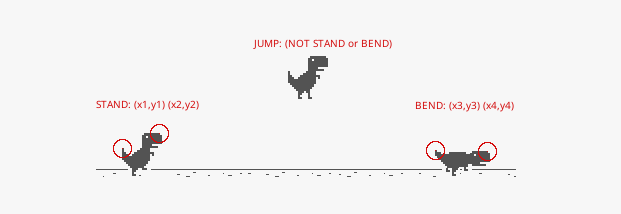

<!--3-->
# Dinosaur and Lisp

2016/08


Dinosaur is old enough, as well as Lisp, they may like each other. When I am talking about dinosaur here, I mean the dinosaur hiding in Google Chrome, it shows up when "There is no Internet connection".

### What's This All about?

This is about writing some code in Common Lisp, which is capable of playing the Chrome Dinosaur Game itself (no [Deep Learning](https://en.wikipedia.org/wiki/Deep_learning) involved).

### What Do We Have in Hand?

When I'm trying to do this, I'm sitting in front of a computer with Linux installed, and of course it has a screen monitor. So, it is easy to set up a Common Lisp environment, here is my list:

* A Linux Machine (with screen monitor connected, to watch the dinosaur jump)
* [SBCL](http://www.sbcl.org/) (I'm using 1.3.4 now, higher may be better)
* [Chromium](https://download-chromium.appspot.com/) or [Google Chrome](https://www.google.com/chrome/browser/desktop/index.html) (I'm using Chromium 52.0.2743.116 now)

I also installed [Emacs](https://www.gnu.org/software/emacs/) with [SLIME](https://common-lisp.net/project/slime/) to play around with Lisp, you can have any other editor instead of this.

Well, all set, let's start.

### the Eyes

It's easy for us to recognize the dinosaur, a tiny cute creature with two short legs running on our screen, but it's not easy for Lisp. We can see the screen with our eyes, Lisp can't, so we gonna write some code to read the screen, and find the dinosaur.

##### Read the Screen

After searching the web, I found that there's no concept of Screen in Common Lisp. Actually, I found this:

> ... There are only rudimentary libraries for manipulating strings, and **almost none** for talking to the operating system. For historical reasons, Common Lisp tries to pretend that **the OS doesn't exist** ...

\- [Being Popular (Section 6)](http://www.paulgraham.com/popular.html)

"the OS doesn't exist", what the ... , I must be lost my mind to choose Common Lisp.

But since that article is written in May 2001, it's been 15 years later, things must have been changed a lot. After digging around again, I found something very useful:

* [CFFI](http://www.cliki.net/CFFI), the Common Foreign Function Interface, and this means we can call any C (and not only) library from Lisp.
* [CLX](http://www.cliki.net/CLX), an implementation of the X Window System protocol to Lisp, and this means we can take control of the whole X Window System, of course we can read the screen! (if you are using [OS X](https://support.apple.com/en-us/HT201341) or [Windows](http://x.cygwin.com/), this may be a little tricky)
* [burgled-batteries](http://www.cliki.net/burgled-batteries), a Python-Lisp bridge, and this means we can call any Python functions seamlessly in Common Lisp.

Actually, there's [plenty of libraries](http://www.cliki.net/current%20recommended%20libraries) out there today, you can basically do anything you want in Common Lisp, **the OS does exist!** Hooray~

##### Finding Dinosaur

After reading the [CLX Manual](https://common-lisp.net/project/cmucl/doc/clx/), we found that we can use function `get-raw-image` to directly [get the image data from the specific region](https://common-lisp.net/project/cmucl/doc/clx/7_5_Direct_Image_Transfer.html). Then what? Let's find out what we need to find the dinosaur:

* What's in my mind now? well, the dinosaur is keep running and running, we need to keep read the screen and find it's position. Yah, let's do it.
* OK, I am reading the screen every 0.1 seconds, and now I need to write some code to match the shape pattern of the dinosaur.
* Shape Matching, sounds thrilling, I've never been there before, then after another round of searching, I found some papers:
  * [Shape Matching and Object Recognition Using Shape Contexts](http://graphics.stanford.edu/courses/cs468-08-fall/pdf/belongie-pami02.pdf)
  * [Shape Matching](http://www.cs.utexas.edu/~grauman/courses/spring2008/slides/ShapeMatching.pdf)
  * [FINDING COLOR AND SHAPE PATTERNS IN IMAGES](http://i.stanford.edu/pub/cstr/reports/cs/tr/99/1620/CS-TR-99-1620.pdf)
* I started to read, the papers are obscure, Mm... they are talking about math, Mm... I don't recognize this mathematical formula, Mm...
* I have to take a break, let's play the Dinosaur Game.
* Oh, my! The dinosaur never moved! It is just keep dangling it's tiny legs and pretending: "Yah, I am running, I am running".
* This is the ultimate humiliation to my extraordinary human intelligence.

But I've been over it almost immediately, cause I have no need to read those obscure papers anymore, phew~

Then, what's left?

All we have to do about this dinosaur now, is to determine the current state of our dinosaur: **STAND**ing / **JUMP**ing / **BEND**ing (yah, it can bend, try the down key).



Since the dinosaur never really moved forward or back, we can take screenshots of the different postures of our dinosaur, then open them in [GIMP](https://www.gimp.org/) to get the corresponding position points, we can do this in our code:

```Lisp
(defvar *dino-standing-points* '((207 238) (242 223)))
(defvar *dino-bending-points* '((209 240) (262 243)))
```

After we have these points, we can capture the image data of current screen, then get the colors of those specific dots, and determine if the color equals to the color of dinosaur, if all `*dino-standing-points*` matched, then it is standing, as well as `*dino-bending-points*`, otherwise it is jumping.

But after playing a while, we know that the color of dinosaur is changing between day and night, so we should have a function to get the changing color of the dinosaur. Since the dinosaur is jumping or bending, it's much easier to locate the color picking point of background, then we can determine the state of the dinosaur by using the background color: If all the color of `*dino-standing-points*` _does not match_ the background color, then it is standing.

Dinosaur Finding Problem solved.

##### Cactuses and Birds

These front cactuses and birds could kill our dinosaur. So we have to detect them and take an action of **JUMP** / **BEND** or just **STAND** still (the time of action also matters). We can get the image data in front of the dinosaur, and check if there is a cactus or bird:


The search area could be narrowed down to a 500x35 square, and the position of this square is fixed, we can easily get it from a full screenshot with [GIMP](https://www.gimp.org/). Then we can write something like this:

```Lisp
;; the block search square (x y weight height)
(defvar *block-search-square* '(265 220 500 35))
```

And when we get the image data of this area, then compare the background color with each pixel, if it does not match, then the cactus or bird is found!

When we comparing the pixels, we choose to scan the image from left/top to right/bottom, then we will get the top/left position of the front cactus or bird.

Here are the cactuses and birds I collected (some kind of cactuses may be missed):


Actually, the types of cactus make nothing different, no matter it is tall or short, wide or narrow, it will be successfully passed if we jump at the appropriate time. But for the birds, we should separate them out by LOW / MIDDLE / HIGH, when it is LOW type bird, we JUMP; when it is MIDDLE type bird, we BEND, when it is HIGH type bird, we do nothing.

From the image above, we can see that those birds in different types have unique y-coordinates among themselves and cactuses, we can just tell which kind of bird it is by the value of it's y-coordinate.

Actually, all we need is the unique y-coordinate of the MIDDLE type bird, cause we can treat the LOW type bird the same as cactuses, and the HIGH type bird, we just pretend they never exist (cause we gonna ignore them). So, all we need is:

```Lisp
;; the y of middle flying bird
(defvar *middle-bird-y* 220)
```

Cactuses and Birds Detecting Problem solved.

Now, here's what we got:

* We know the state of our dinosaur: STANDing / BENDing / JUMPing.
* We know the position of the front cactus or bird.
* We know what action we should take: JUMP / BEND or NOTHING.

What's left?

It's **HOW** and **WHEN**, how to perform the JUMP or BEND action, and when to perform that action. Let's discuss them next.

### Dancing Around

##### HOW?

To jump or bend our dinosaur, we need to simulate the key press event of <kbd>SPACE</kbd> (or <kbd>UP</kbd>) and <kbd>DOWN</kbd>.

The X Window System must have a way to simulate key press event, and also [CLX](http://www.cliki.net/CLX) is an implementation of the X Window System protocol to Lisp, it means we have a way to simulate key press event as well. Once we figure out how, we'll be able to control the dinosaur.

After reading the [CLX Manual](https://common-lisp.net/project/cmucl/doc/clx/), we found a section called: [Event and Input](https://common-lisp.net/project/cmucl/doc/clx/12_Events_and_Input.html), it's all about events manipulating, we may use them. But after talking with some awesome fellas on IRC, I learned that there's an extension of X Window System called [XTEST](https://www.x.org/docs/Xext/xtest.pdf), which is "a minimal set of client and server extensions required to completely test the X11 server with no user intervention", and it has an operation called  `XTestFakeInput` which can be used to perform a fake key/mouse input as it is said by it's name.

And more luckily, this extension is already [implemented in CLX](https://github.com/sharplispers/clx/blob/master/extensions/xtest.lisp), so we can directly call the function `fake-key-event` or `fake-button-event`, they should just work! What a good day~ Now we can call something like this in the [REPL](https://en.wikipedia.org/wiki/Read–eval–print_loop):

```Lisp
(xtest:fake-key-event display *space-keycode* t) ; key down
(xtest:fake-key-event display *space-keycode* nil) ; key up
```

Then the dinosaur jumped, :-D

##### WHEN?

We should start to jump when we getting close to the cactus or bird, but how close? 100px? or 200px? should we test all these values and find the best one? No, there's no one. We can't say "Hey tiny dino, you should jump when the distance between you and the cactus in front is less than 100px", because the speed is accelerating. Maybe 100px works pretty well when it is slow, but when the game speed up, the value should be far more than 100px.

So, it is speed related, huh~ Since we can get the coordinates of the front cactus, calculate the speed will be done by dividing the change of x-coordinate by time passed, we can collect all the speed value each time we read the screen, then get the average value. Then we should figure out something like this:

```Lisp
(defun jump? (distance speed)
    (<= (/ distance speed) 0.15))
```

This function `jump?` take two parameters: `distance`, which represent the distance between the dinosaur and the front cactus; `speed` , which represent the speed of the cactus. Then, `(/ distance speed)` will be the time left before cactus hit our dinosaur, `0.15` is the time we preserved for our dinosaur to take it's feet off the ground. So, this function means: If we the cactus will hit our dinosaur in 0.15 seconds, we jump, then at the time cactus comes, our dinosaur will be right up in the sky, cactus passed!


Then, we can read the screen 60 times per second, and call `jump?` in every screen reading action, to check if we should jump.

### At Last

After playing around with all the code snippets in SLIME-REPL, seems all systems go:

* Screen Reading, powered by [get-raw-image](https://common-lisp.net/project/cmucl/doc/clx/7_5_Direct_Image_Transfer.html)
  * Dinosaur State Checking (stand or bend or in the sky?)
  * Game State Checking (game over or not)
  * Cactuses and Birds Detection
* Keyboard/Mouse Simulation, powered by [fake-key-event](https://github.com/sharplispers/clx/blob/master/extensions/xtest.lisp#L130) and [fake-button-event](https://github.com/sharplispers/clx/blob/master/extensions/xtest.lisp#L117)
  * Dinosaur Controller (<kbd>SPACE</kbd> and <kbd>DOWN</kbd> key)
  * Game Activation (click to active the game window)

Just do a little more clean up, we'll have a Common Lisp-powered Super Dinosaur~

Now, we won't go through the details of the code implementation, you can find them at the end of this page.

Before we go, I wanna say: Lisp is not the old fragile useless academic language, also, it's not any alien super power. It's a language, it works if you really touched it, and works great.

**Video on YouTube:**

https://youtu.be/PkzlJcKR4TI


**Code on GitHub:**

https://github.com/VitoVan/cl-dino

I am pretty new to Common Lisp, the code may be a little messy (although I tried not to be like that), it will be great if you can point out something inelegant for me, thanks!

---

License: GNU GPL v2.0

Discuss on HN: https://news.ycombinator.com/item?id=12351187

**Related:**

* [Japanese Translation](http://postd.cc/dinosaur-and-lisp/)
