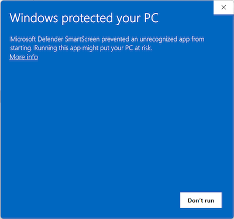
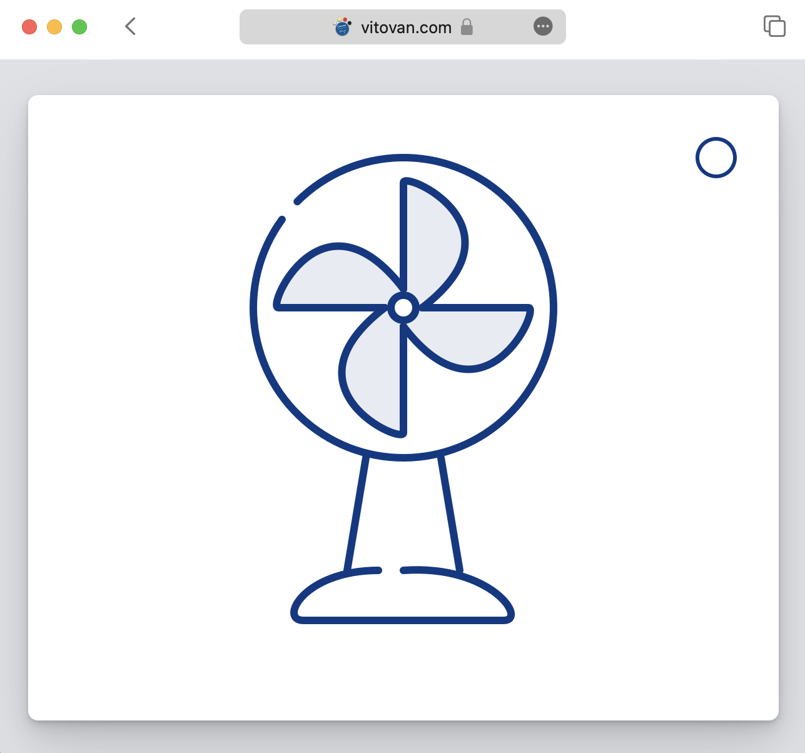

<!--7-->
# Porting Lisp Game to the Web

2023/06


## TL;DR

Here is a game written in Common Lisp and ported to the web:

[Pelúsica: Survive and make melodies](https://github.com/VitoVan/pelusica/#readme)

[](https://github.com/VitoVan/pelusica/#readme)

It's an action game in which you can control the blue dot with your keyboard to create music and avoid colliding with other dots.

You can play it in your browser:

[](https://vitovan.com/pelusica/0.0.5/calm.html)

or download it for [Linux](https://github.com/VitoVan/pelusica/releases/latest/download/Pelusica.AppImage), [macOS](https://github.com/VitoVan/pelusica/releases/latest/download/Pelusica.macos-13.dmg), and [Windows](https://github.com/VitoVan/pelusica/releases/latest/download/Pelusica.exe).

## Motivation

I made a game, and I sent it to [Jack](https://vitovan.com/jack.html).

Jack asked: "How to run it?"

I thought Jack was stupid, so I ignored him and sent it to Emma.

Emma said: "It cannot be opened."

I was like: "Really?"

It turns out Microsoft and Apple were sitting between me and my friends, saying:

"No, you are not opening this, because Vito didn't pay."

Like this:



or this:


I hate this.

"Who watches the watchmen?" I don't know.

I just want to share my game without making deal with the OS police. Since I don't have the resources to fight them, I have to find a workaround. So I tried porting this game to the web.

Hopefully, we won't encounter the web police too soon.

## Exploration

### to Lisp

The first step should be running Lisp in the browser.

Today we can run [Linux](https://bellard.org/jslinux/) and [Windows](https://copy.sh/v86/) inside a browser, running a Lisp system is just a piece of cake, compared to an operating system.

I found the following two approaches:

- via WebAssembly
  - [Common Lisp running over WebAssembly for the first time](https://news.ycombinator.com/item?id=31590819)
  - [ECL targetting WASM via Emscripten - preliminary support](https://gitlab.com/embeddable-common-lisp/ecl/-/merge_requests/277/commits)
  - [A WebAssembly Version of Chaitin's Lisp](http://weitz.de/chaitin/)
  - [Wisp - Lisp in WebAssembly](https://www.fermyon.com/wasm-languages/lisp)
- via JavaScript
  - [SLip — a Lisp system in JavaScript](https://lisperator.net/slip/)
  - [JACL: JavaScript Assisted Common Lisp](https://tailrecursion.com/JACL/)
  - [Valtan: Common Lisp to JavaScript Compiler](https://github.com/cxxxr/valtan)
  - [JSCL - A Lisp-to-JavaScript compiler](https://github.com/jscl-project/jscl/)

I didn't list everything here, you could find more. I also didn't list the approach of (Lisp (inside an emulated x86 (inside a browser))), because it sounds too aggressive.

The point is the work could be done or has already been done.

So, what now?

### to Game

We need to be able to provide an interactive multimedia experience to the players, that is:

- to respond to the user inputs
- to present dynamic graphics
- to play music and sounds

Lisp the great and powerful itself won't do any good to that, unless you cut the graphic and sound parts, and decide to make a text-based game.

#### Compiling SDL2 and Cairo

I was using [SDL2](https://libsdl.org/) and [Cairo](https://www.cairographics.org/) to provide the interactive multimedia experience on the desktop, with the assistance of [cl-sdl2](https://github.com/lispgames/cl-sdl2) and [cl-cairo2](https://github.com/rpav/cl-cairo2).

How do I use them in the browser? 

Maybe we could try WebAssembly.

SDL2 is WebAssembly-ready since [the last year](https://github.com/emscripten-core/emscripten/pull/15452).

And I spent some time on Cairo and [compiled Cairo into WebAssembly](https://github.com/VitoVan/pango-cairo-wasm/).

#### Try to Use SDL2 and Cairo With Lisp

Now we know that we can use SDL2 and Cairo in the browser, but how?

On the desktop, we use [cl-sdl2](https://github.com/lispgames/cl-sdl2) and [cl-cairo2](https://github.com/rpav/cl-cairo2), which is [CFFI](https://cffi.common-lisp.dev/) → `load-shared-object` →  `dlopen` under the hood. 

How do we do it in WebAssembly?  Or, is it possible?

It is possible.

[Dynamic Linking](https://emscripten.org/docs/compiling/Dynamic-Linking.html) and [dlopen](https://emscripten.org/docs/compiling/Dynamic-Linking.html#practical-details) in WebAssembly is [not](https://github.com/emscripten-core/emscripten/blob/9eff02bc816c50ab0e3b70a3bd5b72a8dc2893a2/test/other/test_dlopen_blocking.c#LL7C18-L7C24) a [problem](https://github.com/emscripten-core/emscripten/blob/9eff02bc816c50ab0e3b70a3bd5b72a8dc2893a2/test/other/test_dlopen_async.c#L25), the problem is to make CFFI work with it.

No, not with *it*, with the Lisp implementation we chose.

CFFI depends on [ASDF](https://asdf.common-lisp.dev/) and [libffi](https://sourceware.org/libffi/). libffi had its WebAssembly support [earlier this year](https://github.com/libffi/libffi/pull/763), so we only need to focus on ASDF. 

Only one of the above Lisps was officially supported by ASDF, which is [ECL](https://ecl.common-lisp.dev/). So, to save time, we should stick to ECL and see if we can make any progress.

 

<br/>


I paused.

 

<br/>


I was intimidated by ECL when I was young and fragile.

It was a long long time ago, one day morning, I loaded my project into ECL and tried to generate a standalone application. It took a thousand years to compile and end up with some [weird](https://stackoverflow.com/questions/46520876/building-an-executable-with-ecl-missing-dependency-or-can-not-find-make-build-i) ASDF-related [error](https://old.reddit.com/r/Common_Lisp/comments/hicmyt/error_with_uiop_running_ecl_application_built_by/) that I still can't solve today. I also failed to upgrade [ASDF for ECL](https://gitlab.common-lisp.net/ecl/ecl/-/blob/develop/contrib/asdf/README.ECL) after many hours of scrambling. I must say this was solely because of my stupidity, ECL is great, I am just too dumb.


<br/>


And I paused.


<br/>


I was so frightened by this task, so I asked Daniel, whose name will be printed out along with the word "Copyright" when you were starting ECL, like this:

```lisp
ECL (Embeddable Common-Lisp) 21.2.1 (git:6af4b3e51f80d569d88f0e8a4782b21c8b04970e)
Copyright (C) 1984 Taiichi Yuasa and Masami Hagiya
Copyright (C) 1993 Giuseppe Attardi
Copyright (C) 2013 Juan J. Garcia-Ripoll
Copyright (C) 2018 Daniel Kochmanski ;; <---- this Daniel
Copyright (C) 2021 Daniel Kochmanski and Marius Gerbershagen
ECL is free software, and you are welcome to redistribute it
under certain conditions; see file 'Copyright' for details.
Type :h for Help.
Top level.
>
```

And Daniel [said](https://www.reddit.com/r/lisp/comments/ys7jpl/ecl_targetting_wasm_via_emscripten_preliminary/jjz39oh/): "go for it!" 

Then I went for it.

That's when the nightmare began. It turns out that making ASDF work with ECL in the browser is way more difficult than on the desktop. 

I was drowned in the sea of ECL source code; suffocated on the mountain of Emscripten reference; and lost in the forest of 13987 lines of asdf.lisp.

Although [Marius Gerbershagen](https://gitlab.com/spaghettisalat) (another ECL maintainer, also listed in the ECL copyright notice) pointed out [another path](https://gitlab.com/embeddable-common-lisp/ecl/-/merge_requests/277#note_1398797537) (static linking) for me to achieve the goal, I still haven't made it.

My intelligence was heavily questioned.

<br/>


I felt sad and paused again.


Until one day.

<br/>


I was talking with Jack on the phone:

"Now, press the <kbd>return</kbd> key."

"Where is the <kbd>return</kbd> key?"

"It's on your keyboard, damn! The one above <kbd>shift</kbd>!"

"Oh, you mean <kbd>Enter</kbd>?"

"......"


Jack was using a Windows PC, and the letter on his keycap is "Enter". 

I was using a MacBook, it is "return".


So: If my game were running in the browser one day, how do I know the player's operating system? 

Did you just say `navigator.userAgent`? `navigator.platform`? 

Yeah, that's it! 

Wait, what language is that? JavaScript? 

No, shit.

#### If Using JavaScript Were Inevitable

It seems to be it.

Running in the browser, you have to deal with the browser.

Not only to detect the operating system but also:

- to [detect](https://github.com/emscripten-core/emscripten/issues/3985) the browser's preferred sampleRate of [AudioContext](https://developer.mozilla.org/en-US/docs/Web/API/AudioContext/AudioContext)
- to get the parameter of the URL, like: `?name=Jack`
- to get the current window size
- to redirect the page to my cool web blog
- to show an evil alert
- ...

With C, we can [call JavaScript](https://emscripten.org/docs/porting/connecting_cpp_and_javascript/Interacting-with-code.html#calling-javascript-from-c-c) like this:

```c
#include <emscripten.h>

EM_JS(void, call_alert, (), {
  alert('hello world!');
  throw 'all done';
});

int main() {
  call_alert();
  return 0;
}
```

With Lisp, how?

We can:

1. write JavaScript in a C function
2. expose that the C function
3. `defcfun` in Lisp with CFFI to use it

If the above feels too complicated, we can also use [SFFI](https://ecl.common-lisp.dev/static/manual/Foreign-Function-Interface.html#SFFI-Reference) from ECL, to (write JavaScript code (inside C code (inside Lisp code))), *maybe* like this:

```lisp
(defun alert (x)
  (ffi:clines "#include <emscripten.h>")
  (ffi:c-inline (x) (:cstring) :void "
        EM_JS(void, call_alert, (), {
          alert('hello world!');
          throw 'all done';
        });
        call_alert(#0);
"))
```

Beautiful, right? I wouldn't dare to touch things like that, it's holy and sacred, and it should be reserved for sainthood.


Now let's forget the SFFI approach and sort out our tasks:

- make WASM Dynamic Linking, ASDF, CFFI, and ECL work,

  or make ASDF, CFFI, WASM ECL statically linked with Cairo working

- write an unknown amount of JavaScript in C and wrap them in CFFI

- compile all those pieces of spaghetti code into WebAssembly

- press our palms together and pray

I am only good at the last one.

#### Using SDL2 and Cairo With Lisp in JSCL

If

1. using JavaScript were inevitable
2. using SDL2 and Cairo with WASM Lisp were hard to achieve

then, why don't we

- use a JavaScript-powered Lisp to interact with JavaScript, then
- use SDL2, Cairo WASM exported functions within JavaScript, then
- wrap the JavaScript call with some Lisp code?

Let's try [JSCL](https://jscl-project.github.io/), to call JavaScript within Lisp:

```lisp
(#j:alert "this is an alert")
```

If we exported [SDL_GetTicks](https://wiki.libsdl.org/SDL2/SDL_GetTicks) via [emscripten](https://emscripten.org/), we could call it in Lisp, like:

```lisp
(#j:_SDL_GetTicks)
```

Convenient, right?

Now, let's sort out our tasks again:

- export all the needed functions via emscripten
- wrap them a little for ease of use
- done

Oh, really?

Yes, really.

I [exported](https://github.com/VitoVan/calm/blob/b683b2a8e983ff508069ad95aa7c9ab6415b8080/s/usr/web/wasm.lisp#L46) all the frequently used SDL2 and Cairo functions, then wrapped them with [some Lisp code](https://github.com/VitoVan/calm/blob/main/src/web/cairo.lisp#L268), and then I can call them as if I were on the desktop operating system:

```lisp
(defun draw-blade (&optional (degree 0))
  (c:save)
  (c:translate 300 170)
  (c:rotate (* degree (/ pi 180)))
  (c:move-to 0 -15)
  (c:line-to 0 -100)
  (c:curve-to 0 -110 100 -65 15 0)
  (c:stroke-preserve)

  (c:set-source-rgba (/ 12 255) (/ 55 255) (/ 132 255) 0.1)
  (c:fill-path)
  (c:restore))
```



You can try it yourself [with this link](https://vitovan.com/calm/examples-0.1.1/fan/calm.html), the source code is [here](https://github.com/VitoVan/calm/tree/examples-0.1.1/docs/examples/fan).

As I clicked on the blue circle in the upper right corner, a gentle  breeze carrying the scent of freshly cut grass wafted out of the screen. It was then that I knew it was time to call it a day.

## What Now?

With the availability of Lisp in the browser, along with SDL2 and Cairo, the possibilities for interesting projects are endless.

The day-to-day development could happen on the desktop with [SBCL](https://www.sbcl.org/) + [SLIME](https://slime.common-lisp.dev/) enabled to get an interactive programming experience. When done, compile everything to WebAssembly + JavaScript, and publish the result online, then you have an application that supports Linux, macOS, Windows, and the web browser!

But, JSCL is [far from complete](https://github.com/jscl-project/jscl/#status).

In the perfect new world, we should expect:

- JSCL (or any other *JavaScript* Lisp) is complete, like [ANSI complete](https://webstore.ansi.org/standards/incits/incits2261994s2008), or

- ECL (or any other *complete* Lisp) and the surrounding ecosystem function seamlessly in the browser


If you're interested, then go for it!

And we don't need a complete Lisp to have fun, right?

I can't wait to see what you are going to make.

;-)

