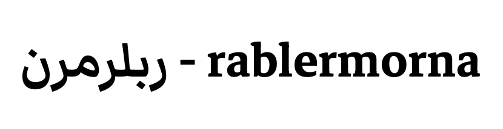
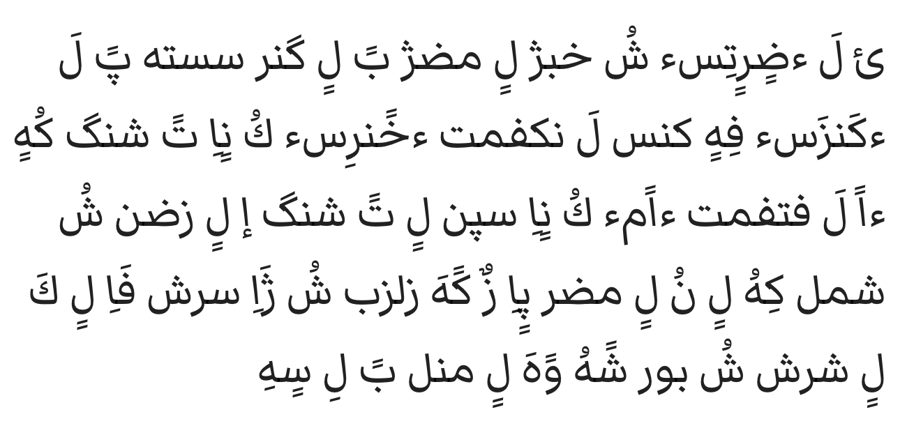
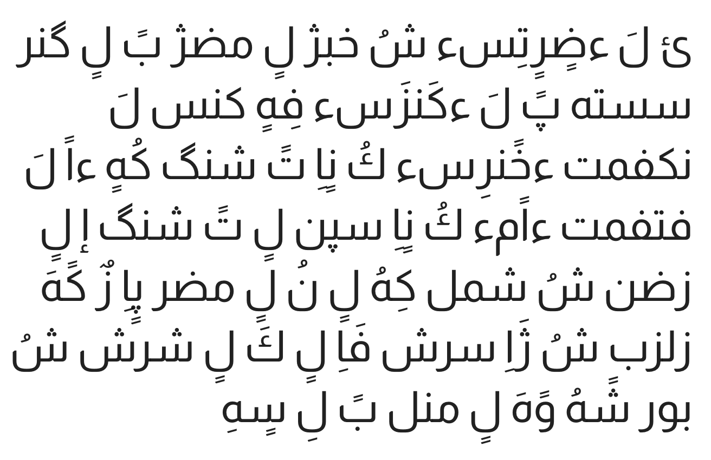

<!--5-->
# ربلرمرن - rablermorna

2019/10

By: la vitno, Version: **رَب  0.1** , PDF: [rablermorna-V0.1.pdf](rablermorna/rablermorna-V0.1.pdf)

Arabic Orthography for [Lojban](https://mw.lojban.org/papri/Lojban) based on Arabic alphabet

### Tables

**Consonants**

| Latin | ربلرمرن |
| ----- | ---------- |
| c     | ش          |
| j     | ژ          |
| s     | س          |
| z     | ز        |
| f     | ف          |
| v     | و          |
| x     | خ          |
| '     | ه          |
| r     | ر          |
| l     | ل          |
| n     | ن          |
| m     | م          |
| b     | ب          |
| d     | ض          |
| g     | گ          |
| k     | ك          |
| p     | پ          |
| t     | ت          |

**Vowels**

When a word have more than one consonants, vowels are allowed to be dropped (unvocalised).

| Latin | ربلرمرن (Indepdt. Form) | ربلرمرن (Diacritic Form) | ربلرمرن (Diacritic Form with 'k/ك') |
| ----- | ----------------------------- | --------------------------- | -------------------------------------- |
| a     | اَ                             | َ                           | كَ                                     |
| e     | اً                             | ً                            | كً                                      |
| i     | اِ                             | ِ                           | كِ                                     |
| o     | اٍ                             | ٍ                           | كٍ                                     |
| u     | اُ                             | ُ                            | كُ                                      |
| y     | اٌ                         | ٌ | كٌ                              |

**Diphthongs**

Diphthongs are just sequences of vowels, except they are not allowed to be dropped.

Diphthongs will always be vocalised, and the second vowel of diphthong is carried by letter '**ا**'.

| Latin | ربلرمرن (Indepdt. Form) | ربلرمرن (Diacritic Form with 'k/ك') |
| ----- | --------------------------------------- | --------------------------------------- |
| ai    | اَاِ                                       | كَاِ                                    |
| ei    | اًاِ                                      | كًاِ                                   |
| oi    | اٍاِ                                      | كٍاِ                                    |
| au    | اَاُ                                       | كَاُ                                     |
| ia    | اِاَ                                      | كِاَ                                    |
| ie    | اِاً                                       | كِاً                                     |
| ii    | اِاِ                                       | كِاِ                                     |
| io    | اِاٍ                                      | كِاٍ                                    |
| iu    | اِاُ                                       | كِاُ                                     |
| ua    | اُاَ                                      | كُاَ                                     |
| ue    | اُاً                                       | كُاً                                      |
| ui    | اُاِ                                      | كُاِ                                     |
| uo    | اُاٍ                                      | كُاٍ                                      |
| uu    | اُاُ                                       | كُاُ                                      |
| iy | اِاٌ | كِاٌ |
| uy | اُاٌ | كُاٌ |

### Text Examples

| Name                      | Text Sample                                                  |
| ------------------------- | -----------------------------------------------------------: |
| Standard Orthography      | ni'o la .dorotis. cu xabju lo midju be lo ganra sastu'a pe la .kanzas. fi'o kansa la nakfamti .xenris. ku noi te cange ku'o .e la fetfamti .em. ku noi speni lo te cange .i lo zdani cu cmalu ki'u lo nu lo mudri poi zy ke'a zilzba cu jai sarcu fai lo ka lo carce cu bevri ce'u ve'a lo minli be li so'i |
| rablermorna (vocalised)          |ئ لَ ءضٍرٍتِسء شُ خَبژُ لٍ مِضژُ بً لٍ گَنرَ سَستُهَ پً لَ ءكَنزَسء فِهٍ كَنسَ لَ نَكفَمتِ ءخًنرِسء كُ نٍاِ تً شَنگً كُهٍ ءاً لَ فًتفَمتِ ءاًمء كُ نٍاِ سپًنِ لٍ تً شَنگً إ لٍ زضَنِ شُ شمَلُ كِهُ لٍ نُ لٍ مُضرِ پٍاِ زٌ كًهَ زِلزبَ شُ ژَاِ سَرشُ فَاِ لٍ كَ لٍ شَرشً شُ بًورِ شًهُ وًهَ لٍ مِنلِ بً لِ سٍهِ |
| rablermorna (unvocalised)          | ئ لَ ءضٍرٍتِسء شُ خبژ لٍ مضژ بً لٍ گنر سسته پً لَ ءكَنزَسء فِهٍ كنس لَ نكفمت ءخًنرِسء كُ نٍاِ تً شنگ كُهٍ ءاً لَ فتفمت ءاًمء كُ نٍاِ سپن لٍ تً شنگ إ لٍ زضن شُ شمل كِهُ لٍ نُ لٍ مضر پٍاِ زٌ كًهَ زلزب شُ ژَاِ سرش فَاِ لٍ كَ لٍ شرش شُ بور شًهُ وًهَ لٍ منل بً لِ سٍهِ  |

\* Text Sample Source comes from "lo se mànci te màkfa pe la .oz.": http://selpahi.de/oz_plain.html

**Pictures with Different Fonts**

\* Markazi Text https://fonts.google.com/specimen/Markazi+Text

\* Almarai https://fonts.google.com/specimen/Almarai

\* El Messiri https://fonts.google.com/specimen/El+Messiri

---

You can try it with the rablermorna transliteration tool: https://vitovan.com/rablermorna-transliteration/
