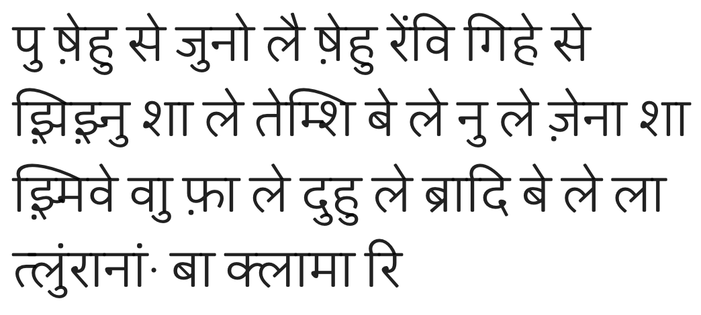
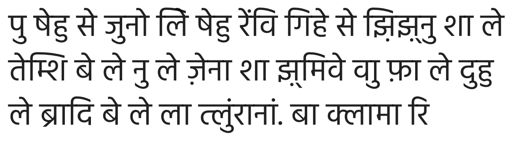
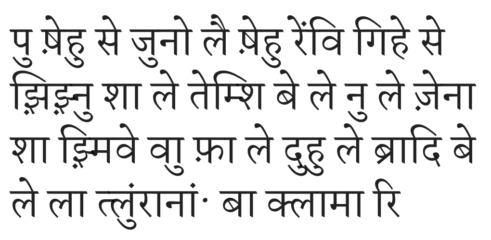

<!--4-->
# ख़िंलेर्मोर्ना - xinlermorna

2019/09

Version: **ख़िं 0.4** , PDF: [xinlermorna-V0.4.pdf](xinlermorna/xinlermorna-V0.4.pdf)

Devanagari Orthography for Lojban based on Hindi pronunciation

### Tables

**Consonats**

Note: all the inherent vowels (a) are dropped.

| Latin | देवनागरी |
| ----- | ---------- |
| c     | श          |
| j     | झ़          |
| s     | स          |
| z     | ष *        |
| f     | फ़          |
| v     | व          |
| x     | ख़          |
| '     | ह          |
| r     | र          |
| l     | ल          |
| n     | न          |
| m     | म          |
| b     | ब          |
| d     | द          |
| g     | ग          |
| k     | क          |
| p     | प          |
| t     | त          |
| dj    | ज          |
| tc    | च          |
| dz    | ज़ *        |
| ts    | च़          |

\* letter **ष** /ʃə/ is assigned the value **/z/**

\* letter **ज़** /zə/ is assigned the value **/ʣ/**

**Vowels**

Since all the inherent vowels of consonats are dropped, when Vowels are written together with consonats, Diacritic Form or Independent Form are **Both Accepted**

| Latin | देवनागरी (Indepdt. Form) | देवनागरी (Diacritic Form) | देवनागरी (Indepdt. Form with 'k/क') | देवनागरी (Diacritic Form with 'k/क') |
| ----- | ----------------------------- | --------------------------- | ---------------------------------------- | -------------------------------------- |
| a     | अ                             | ा                           | कअ                                       | का                                     |
| e     | ए                             | े                            | कए                                       | के                                      |
| i     | इ                             | ि                           | कइ                                       | कि                                     |
| o     | ओ                             | ो                           | कओ                                       | को                                     |
| u     | उ                             | ु                            | कउ                                       | कु                                      |
| y     | य *                           | (none)                      | कय                                       | कय                                     |

\* Since **य** is used as Vowel in Lojban, so it should never be used as conjuncts. This means **ky** will always be written as **कय** instead of **क्य**.

**Diphthongs**

Diphthongs can be written as Vowel Independent Form or Diphthong Independent Form or Diacritic Form, they are **All Accepted**

When **i (इ)** is written as first letter in diphthongs, it should always be written as the Independent Form **इ** (instead of the Diacritic Form  ि). By this way, we are able to seperate words start with **kai... (काि...)** the ones start with **kia... (कइा...)**. If not, we will get **kai... (काि...)** and **kia... (किा...)**, which is hard to tell the differences by a normal human.

| Latin | देवनागरी (Vowel Indepdt. Form) | देवनागरी (Diphthong Indepdt. Form) | देवनागरी (Diacritic Form) | देवनागरी (Vowel Indepdt. Form with 'k/क') | देवनागरी (Diphthong Indepdt. Form with 'k/क') | देवनागरी (Diacritic Form with 'k/क') |
| ----- | ----------------------------------- | --------------------------------------- | --------------------------- | ---------------------------------------------- | -------------------------------------------------- | -------------------------------------- |
| ai    | अइ                                  | अि                                      | ाि                          | कअइ                                            | कअि                                                | काि                                    |
| ei    | एइ                                  | एि                                      | ेि                           | कएइ                                            | कएि                                                | केि *                                   |
| oi    | ओइ                                  | ओि                                      | ोि                          | कओइ                                            | कओि                                                | कोि                                    |
| au    | अउ                                  | अु                                       | ाु                           | कअउ                                            | कअु                                                 | काु                                     |
| ia    | इअ                                  | इा                                      | (none)                      | कइअ                                            | कइा                                                | कइा                                    |
| ie    | इए                                  | इे                                       | (none)                      | कइए                                            | कइे                                                 | कइे                                     |
| ii    | इइ                                  | ई                                       | ी                           | कइइ                                            | कई                                                 | की                                     |
| io    | इओ                                  | इो                                      | (none)                      | कइओ                                            | कइो                                                | कइो                                    |
| iu    | इउ                                  | इु                                       | (none)                      | कइउ                                            | कइु                                                 | कइु                                     |
| iy    | इय                                  | इय                                      | (none)                      | कइय                                            | कइय                                                | कइय                                    |
| ua    | उअ                                  | उा                                      | ुा                           | कउअ                                            | कउा                                                | कुा                                     |
| ue    | उए                                  | उे                                       | ुे                            | कउए                                            | कउे                                                 | कुे                                      |
| ui    | उइ                                  | उि                                      | ुि                           | कउइ                                            | कउि                                                | कुि                                     |
| uo    | उओ                                  | उो                                      | ुो                           | कउओ                                            | कउो                                                | कुो                                     |
| uu    | उउ                                  | ऊ                                       | ू                            | कउउ                                            | कऊ                                                 | कू                                      |
| uy    | उय                                  | उय                                      | ुय                           | कउय                                            | कउय                                                | कुय                                     |

\* When **kei** is written in Diacritic Form as **केि**, it may not be rendered properly by every font. Hence, Devanagari Vowel **ai (ऐ / ै)** is also acceptable to be used as **ei.** And **kei** can also be written as **कऐ** or **कै**, respectively.

### Anusvara

When consonat **n** is supposed to be pronounced as **/ŋ/** (e.g. ka**n**la), you can use a diacritic dot (which is called Anusvara: ं) to mark it instead of the independent form **n** (न), write with Anusvara or Independent Form are **Both Accepted**

| latin | देवनागरी (Indepdt. Form) | देवनागरी (Anusvara) |
| ----- | ----------------------------- | --------------------- |
| kanla | कानला                         | कांला                  |
| condi | शोनदि                         | शोंदि                  |
| panci | पानशि                         | पांशि                  |

### Conjunct Consonats

Consonants lacking a vowel in between them may physically join together as a conjunct consonant. Since all the inherent vowels of consonats are dropped, write with Independent Consonats or Conjunct Consonats are **Both Accepted**.

| Latin  | देवनागरी (Indepdt. Consonats) | देवनागरी (Conjunct Consonats) |
| ------ | ---------------------------------- | ------------------------------- |
| lojban | लोझ़बान / लोझ़बां                     | लोझ़्बान / लोझ़्बां                  |
| kanla  | कानला / कांला                       | कान्ला                           |
| ckaji  | शकाझ़ि                              | श्काझ़ि                           |
| klama  | कलामा                              | क्लामा                           |
| bajra  | बाझ़रा                              | बाझ़्रा                           |

### Text Examples

AI = All Independed / VD = Vowels DIacritic / DD = Diphthongs DIacritic / AV = Anusvara / CC = Conjunct Consonats

| Name                      | Text Sample                                                  |
| ------------------------- | ------------------------------------------------------------ |
| Standard Orthography      | pu ze'u se djuno lei ze'u renvi gi'e se jijnu ca le temci be le nu le dzena ca jmive vau fa le du'u le bradi be le la tlunranan. ba klama ri |
| xinlermorna (AI)          | पउ षएहउ सए जउनओ लएइ षएहउ रएनवइ गइहए सए झ़इझ़नउ शअ लए तएमशइ बए लए नउ लए ज़एनअ शअ झ़मइवए वअउ फ़अ लए दउहउ लए बरअदइ बए लए लअ तलउनरअनअन. बअ कलअमअ रइ |
| xinlermorna (VD)          | पु षेहु से जुनो लएि षेहु रेनवि गिहे से झ़िझ़नु शा ले तेमशि बे ले नु ले ज़ेना शा झ़मिवे वअु फ़ा ले दुहु ले बरादि बे ले ला तलुनरानान. बा कलामा रि |
| xinlermorna (VD/DD)       | पु षेहु से जुनो लेि षेहु रेनवि गिहे से झ़िझ़नु शा ले तेमशि बे ले नु ले ज़ेना शा झ़मिवे वाु फ़ा ले दुहु ले बरादि बे ले ला तलुनरानान. बा कलामा रि |
| xinlermorna (VD/DD/AV)    | पु षेहु से जुनो लेि षेहु रेंवि गिहे से झ़िझ़नु शा ले तेमशि बे ले नु ले ज़ेना शा झ़मिवे वाु फ़ा ले दुहु ले बरादि बे ले ला तलुंरानां. बा कलामा री |
| xinlermorna (VD/DD/AV/CC) | पु षेहु से जुनो लेि षेहु रेंवि गिहे से झ़िझ़्नु शा ले तेम्शि बे ले नु ले ज़ेना शा झ़्मिवे वाु फ़ा ले दुहु ले ब्रादि बे ले ला त्लुंरानां. बा क्लामा रि |

\* Text Sample Source comes from "How the enemy came to Thlunrana": https://jbotcan.org/lojban/en/how-the-enemy-came-to-thlunrana/

**Pictures with Different Fonts**

Only VD/DD/AV/CC version is illustrated

\* Jaldi https://fonts.google.com/specimen/Jaldi

\* Hind https://fonts.google.com/specimen/Hind

\* Martel https://fonts.google.com/specimen/Martel

